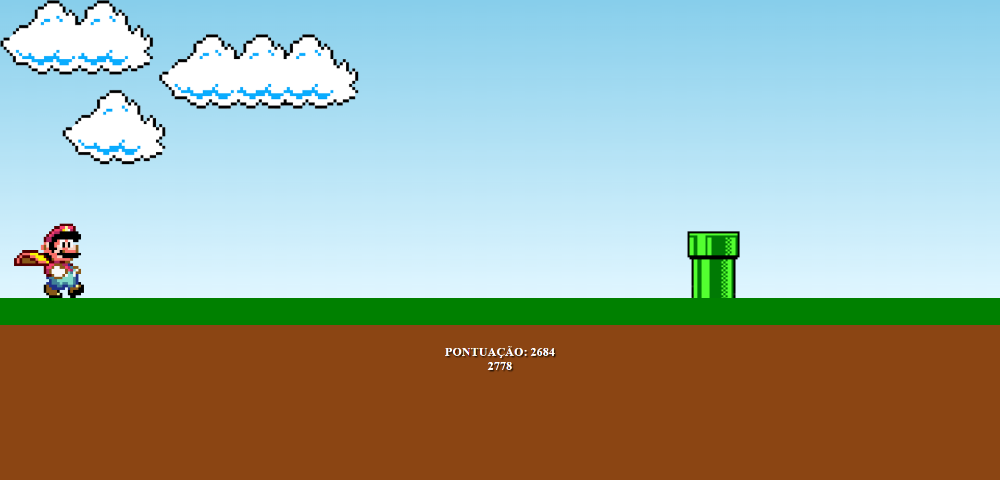

# 🎮 JOGO DO SUPER MARIO 🎮

## 🕹️ COMO JOGAR ?
O jogo funciona da seguinte forma, na tela com os canos, aparecerá uma topeira e você precisa clicar no máximo de topeiras que você conseguir, mas cuidado, nesses canos aparecerá uma planta carnivora que não pode ser tocada se não é GAME OVER .

## COMO EXECUTAR O PROJETO
Para executar o projeto você precisa clonar este repositório e após isso você pode abrir a página index.html, ou se preferir, pode baixar a extensão do vsCode liveServer e executar o projeto atráves desta extensão.

## **📈 OBJETIVO:**
### 📚 Aprendizado
### 🧠 Conhecimento
### ⭐ Sucesso
 

# **🛠 LINGUAGENS UTILIZADAS:**

  

